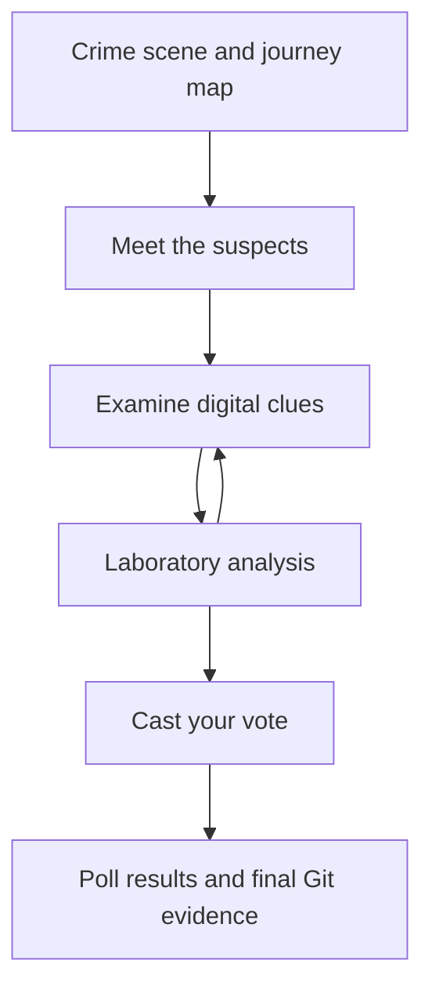

# dog_murder_mistery_game
Paw & Order: The Broken Pipe Unit

An interactive dog-themed mystery game developed in R and Quarto during the RAUKR 2026 Data Science With R course.

Overview

The international RuffR Data Science Conference is taking place at Campus Gotland in Visby. At 02:13, the conference’s R pipeline suddenly stops working. Someone has chewed the > from the native pipe operator:

suspects |
  filter(has_alibi == FALSE)

Twenty-five dogs are attending the conference, but only five members of the overnight Pipeline Response Team had access to the restricted project room.

The player must examine the evidence, test the suspects’ alibis and identify who broke the R code.

The suspects
Sava Sniffer — a Serbian Hound from Serbia
Klara Cache — a Karst Shepherd Dog from Slovenia
Byte Biter — a Chihuahua from Mexico
Kommissar RegEx — a German Shepherd Dog with German–Austrian citizenship
Vera Vector — a Swedish Vallhund from Sweden

Each suspect has a different programming speciality, travel history and explanation for their whereabouts at the time of the crime.

Gameplay

The investigation progresses through several stages:

Explore an interactive map showing the suspects’ journeys to Visby.
Meet the five suspects and learn about their breeds and conference roles.
Examine evidence from Git, the targets cache and server logs.
Reveal clue results to eliminate innocent suspects.
Analyse simulated bite-mark, hair and paw-print evidence.
Vote for one of the two remaining finalists.
Compare the vote with the choices made by other players.
Unlock the final Git evidence and discover the culprit.
Planned features
Multi-page Quarto website
Interactive world map using Plotly
Dog-breed information based on FCI and open data
Expandable clues with hidden findings
Simulated forensic datasets
Bite-mark interval plot
Dog-hair feature heatmap
Paw-print comparison plot
Interactive voting system
Aggregate voting results
Post-vote Git reveal
Final suspect portrait and musical conclusion
Evidence sources

The fictional investigation uses four categories of evidence:

Git commit history and reflog
targets cache and workstation metadata
Conference server logs
Simulated forensic analysis of bite marks, hair and paw prints

All forensic measurements used in the game are fictional and created for educational purposes.

Technology

The project uses:

R 4.6.1 for data processing and analysis
Quarto for the website
Positron as the development environment
tidyverse for data manipulation
stringr for regular-expression searches
ggplot2 for forensic visualizations
Plotly for interactive plots and maps
targets for reproducible data pipelines
renv for package management
Shiny for voting and conditional content
Git and GitHub for version control and collaboration
Project structure
.
├── _quarto.yml
├── index.qmd
├── suspects.qmd
├── clues.qmd
├── lab.qmd
├── verdict.qmd
├── _targets.R
├── R/
│   ├── prepare_data.R
│   ├── create_map.R
│   ├── analyse_evidence.R
│   └── voting.R
├── data/
│   ├── suspects.csv
│   ├── server_logs.csv
│   └── forensic_evidence.csv
├── images/
│   └── suspects/
├── styles.scss
├── renv.lock
└── README.md
Getting started
Requirements

Install the following software:

R 4.6.1 or a compatible version
Quarto
Positron, RStudio or another R-compatible editor
Git
Clone the repository
git clone <repository-url>
cd <repository-name>
Restore the R environment

Open the project in Positron and run:

renv::restore()
Build the data pipeline
targets::tar_make()
Preview the website

Run the following command in the Positron terminal:

quarto preview

To render the complete website without opening a preview server:

quarto render
Reproducibility

The project uses:

renv to record package versions
targets to manage data-processing dependencies
Git and GitHub to track changes
locally stored, curated breed data to prevent unexpected upstream changes
fixed random seeds when generating fictional forensic measurements
Data attribution

Breed names, countries of origin and FCI classifications are derived from publicly available dog-breed data.

Dog photographs must include:

photographer or creator
source URL
licence
descriptive alternative text

Fictional character names, conference roles, alibis and forensic evidence were created specifically for this project.

Spoiler

<details> <summary><strong>Reveal the solution</strong></summary>

Byte Biter, the Chihuahua, broke the R pipeline.

A deleted commit recovered through the Git reflog reveals the change:

- suspects |>
+ suspects |

Byte attempted to reset the branch and remove the evidence, but the deleted commit remained recoverable.

Git remembers everything.

</details>

Course context

This project was developed as a group exercise based on material from the RAUKR 2026 Advanced R course.

It demonstrates how reproducible programming, data visualization, version control and interactive web development can be combined in a single R project.

Contributors
Add contributor name
Add contributor name
Add contributor name
Add contributor name
Add contributor name

Licence

Add the chosen project licence here. Data and image sources may be subject to separate licences.


Data Science With R - more details

The cleanest design is a five-page investigation. The first four pages can remain ordinary Quarto pages; only the voting/verdict page needs Shiny and persistent storage.



## 1. Homepage: `index.qmd`

This gives a clear reason why only five of the 25 dogs are suspects without already presenting crime evidence.

# The Case of the Broken Pipe 

## Crime scene: Visby

Twenty-five dogs had travelled to Campus Gotland in Visby for the international **RuffR Data Science Conference**.

At 02:13, long after the final scheduled coding session had ended, the project room fell mysteriously silent. The conference’s R pipeline had stopped working.

Investigators discovered that someone had chewed the `>` from the native pipe operator:

```r
suspects |
  filter(has_alibi == FALSE)
```

A damaged keyboard, several strands of dog hair and a partial bite mark were found beside the computer. Unfortunately, the bite impression was incomplete and the hair sample appeared to contain material from more than one dog.

Neither clue could identify the culprit.

## Why are there only five suspects?

Twenty of the conference dogs had already left the restricted project wing. Their departure was confirmed by collar-badge scans and their attendance at the official **Paws and Plots** closing social.

Five dogs belonged to the conference’s overnight **Pipeline Response Team**. They were the only delegates whose badges allowed access to the project wing after midnight.

Shortly before 02:13, the access system recorded all five inside the restricted wing. The project-room door showed no sign of forced entry, and no unknown badge had been used.

The culprit therefore had to be one of these five dogs:

* **Sava Sniffer**, a Serbian Hound from Serbia
* **Klara Cache**, a Karst Shepherd Dog from Slovenia
* **Byte Biter**, a Chihuahua from Mexico
* **Kommissar RegEx**, a German Shepherd Dog with German–Austrian citizenship
* **Vera Vector**, a Swedish Vallhund from Sweden

Each dog claimed to have been somewhere else inside the conference building—but not every alibi was equally reproducible.

Investigators recovered four sources of evidence:

* the Git commit history
* the `targets` cache and workstation metadata
* the conference server logs
* a preliminary forensic report on the bite mark, dog hair and paw print

Your task is to examine the evidence and eliminate innocent suspects. The first clues will narrow the investigation to two plausible finalists.

You must then cast your vote before the sealed final report is opened.

## Five journeys, one destination

The map below shows where the suspects began their journeys and how they travelled to Visby. Select a dog to learn their name, breed, country of origin and conference speciality.

The map introduces the suspects. It does not contain evidence about the crime.

**Are you ready to open the case file?**

[Meet the suspects](suspects.qmd){.btn .btn-primary .btn-lg}

### Interactive map

Use a Plotly world map with five departure locations and Visby as a gold star:

* Sava: Belgrade → Visby
* Klara: Ljubljana → Visby
* Byte: Chihuahua City → Visby
* Kommissar: Berlin → Visby
* Vera: Stockholm → Visby

Use hover labels containing the name, breed, country and conference speciality. Kommissar’s popup can mention his Austrian citizenship, while the route begins in Germany because the German Shepherd’s FCI origin is Germany.

A useful `suspects.csv` structure would contain:

```text
character, breed, country, departure_city, latitude, longitude,
fci_group, speciality, image, image_credit
```

Use FCI data for official breed names, countries and groups. The ChrisVogt repository can still provide supplementary breed information or Wikimedia image links, but verify each image licence and attribution. Save a curated local copy of your five suspects so the website does not unexpectedly change when an upstream repository changes.

## 2. Suspect profiles: `suspects.qmd`

This page contains neutral facts only—no alibis, bite evidence or eliminations.

* **Sava Sniffer** — a Serbian Hound from Serbia. His conference speciality is log-file analysis, debugging and following data trails across complicated repositories.

* **Klara Cache** — a Karst Shepherd Dog from Slovenia. She specialises in reproducible workflows, cached results and the `targets` package.

* **Byte Biter** — a Chihuahua from Mexico. He works on compact code, efficient storage and byte-sized data problems. He insists that every byte counts.

* **Kommissar RegEx** — a German Shepherd Dog with German–Austrian citizenship. He specialises in text searches, pattern matching and code-quality inspections.

* **Vera Vector** — a Swedish Vallhund from Sweden. She works with vectors, factors and keeping unruly data types under control.

End with:

```markdown
[Examine the evidence](clues.qmd){.btn .btn-danger .btn-lg}
```

Use “suspects,” rather than “subjects,” throughout the website. Also use “Chihuahua,” not “Chihuahua terrier”—the Chihuahua is not a terrier breed.

## 3. Digital clue page: `clues.qmd`

This page contains the Git, cache and server-log clues. Use HTML `<details>` elements so the finding remains invisible until clicked.

### Clue 1: The signed commit

Show a simulated `git log --show-signature` result. After the player clicks:

```html
<details>
<summary><strong>Reveal the finding</strong></summary>

The commit was signed from the presentation workstation in another secured room at 02:13. The room’s badge record confirms that Kommissar RegEx was still there.

**Cleared:** Kommissar RegEx

**Remaining suspects:** Sava Sniffer, Klara Cache, Byte Biter and Vera Vector.

</details>
```

### Clue 2: The active cache

Remove the previous Ljubljana alibi. Klara was attending the conference in Visby, so a session in Ljubljana creates a contradiction.

Instead, place her in a separate locked reproducibility laboratory at Campus Gotland. Combine the `targets` metadata with a synchronized badge record:

```r
cache_events |>
  filter(
    user == "klara-cache",
    timestamp >= "02:11:00",
    timestamp <= "02:15:00"
  ) |>
  arrange(timestamp)
```

The hidden finding should say:

> Klara manually approved cache checks at 02:12, 02:13 and 02:14 from Reproducibility Lab 2. A collar-badge scan confirms that she remained in that room, too far from the project room to damage the keyboard.

**Cleared:** Klara Cache
**Remaining:** Sava, Byte and Vera

### Clue 3: The missing semicolon

Keep your regular-expression clue:

```r
server_log |>
  filter(
    str_detect(
      message,
      regex("semicolon|;", ignore_case = TRUE)
    )
  )
```

The hidden finding reveals that Sava was continuously working in another repository from a different secured workstation.

**Cleared:** Sava Sniffer
**Finalists:** Byte Biter and Vera Vector

Then link to:

```markdown
[Send the physical evidence to the laboratory](lab.qmd){.btn .btn-warning}
```

## 4. Laboratory analysis: `lab.qmd`

The laboratory must make both finalists plausible without identifying the culprit.

Use simulated measurements and clearly label them as fictional conference evidence.

### Bite-mark interval plot

Show dental-width estimates for Byte and Vera alongside the incomplete keyboard impression.

* Byte’s small teeth fall inside the possible interval.
* Only part of Vera’s bite was recorded, so her interval also overlaps.
* The graph cannot exclude either finalist.

A horizontal interval plot with `geom_errorbarh()` or `geom_pointrange()` would work well.

### Hair-feature heatmap

Compare features such as:

* hair length
* shaft thickness
* undercoat density
* colour similarity
* scale pattern

The keyboard sample should appear mixed or contaminated. Some features resemble Vera’s coat, while others cannot exclude Byte.

### Paw-print scatterplot

Plot paw width against paw length, with an uncertainty rectangle representing the partial crime-scene print.

Byte’s and Vera’s simulated reference measurements should both overlap that rectangle.

The page conclusion should say:

> The physical evidence has narrowed the case, but it has not solved it. Byte fits the bite evidence; Vera fits part of the hair evidence. The paw print is too incomplete to distinguish between them.

Provide both navigation choices:

```markdown
[Return to the digital clues](clues.qmd){.btn .btn-secondary}

[Cast your vote](verdict.qmd){.btn .btn-danger}
```

## 5. Vote and verdict: `verdict.qmd`

Ask:

> Who broke the R pipeline: the dog with the suspicious bite or the dog with the vector-related motive?

The player chooses only:

* Byte Biter
* Vera Vector

After submission:

1. Save the vote.
2. Display the combined vote totals as a bar chart.
3. Unlock the deleted Git evidence.
4. Reveal Byte’s picture.
5. Show the verdict and music.

### Important voting requirement

A static Quarto site cannot maintain genuine totals shared between different visitors by itself. Use a small Shiny application for this page and save votes in a persistent external database. A local file on shinyapps.io is not reliable persistent storage; Posit recommends an external storage service for data that must survive application restarts. [Quarto supports embedded Shiny components](https://quarto.org/docs/interactive/shiny/), while [shinyapps.io documents its storage limitations here](https://docs.posit.co/shinyapps.io/guide/storage/).

The simplest architecture is:

* Static Quarto pages on GitHub Pages.
* A small Shiny voting app hosted on shinyapps.io or Posit Connect.
* Votes stored in PostgreSQL/Supabase or another persistent service.
* The Shiny app embedded in `verdict.qmd`.
* Store only the selected dog, a random session identifier and timestamp.

Do not place the final clue in the static HTML and merely hide it with CSS. It should be rendered by the Shiny server only after a valid vote has been recorded.

## Corrected final Git clue

Keep the deleted-Git resolution, but make it technically realistic. A reflog records changes to Git references; it does not record individual keystrokes or terminal-history deletion. It can, however, recover a commit that Byte tried to remove by resetting the branch. [Git’s official reflog documentation explains this behaviour](https://git-scm.com/docs/git-reflog).

## Vote recorded

Your vote has been added to the conference investigation.

The chart below shows how all investigators have voted so far.

## Sealed evidence unlocked

While you were voting, the forensic team recovered a local Git reference log from the damaged workstation.

Someone had committed a change and then reset the branch in an attempt to remove it:

```console
$ git reflog --date=format:'%H:%M:%S'

2c81e42 HEAD@{02:13:12}: reset: moving to HEAD~1
9f3a7b1 HEAD@{02:13:07}: commit: minor pipe adjustment
```

The deleted commit was still recoverable:

```console
$ git show --format=fuller 9f3a7b1 -- pipeline.R

Author: Byte Biter <byte-biter@ruffr.example>
CommitDate: 02:13:07
```

```diff
- suspects |>
+ suspects |
```

A separate conference audit record showed that Byte attempted to clear his terminal history immediately afterwards:

```text
02:13:12  byte-biter  command: history -c
```

Finally, the sealed laboratory report arrived. Saliva recovered from the broken `>` key matched Byte Biter.

## Final verdict

**Byte Biter broke the R code.**

He chewed the `>` from the `|>` operator and attempted to delete the evidence. Unfortunately for him, Git remembers where a branch used to point.


### Case closed: Chihuahua!

The RuffR investigators may now celebrate with **“Chihuahua” by DJ BoBo**.

Embed the [official DJ BoBo video](https://www.youtube.com/watch?v=G7QME0bzZuA) only after the verdict:

```markdown

```

Quarto supports this video shortcode directly. Avoid bundling an MP3 or autoplaying the song; use the official video or streaming embed instead. See the [Quarto video documentation](https://quarto.org/docs/authoring/videos.html).

## Suggested Quarto navigation

```yaml
website:
  title: "The Case of the Broken Pipe"
  navbar:
    left:
      - href: index.qmd
        text: Crime Scene
      - href: suspects.qmd
        text: Suspects
      - href: clues.qmd
        text: Clues
      - href: lab.qmd
        text: Laboratory
```

Omit `verdict.qmd` from the navigation so players reach it through the investigation. Quarto website navigation is configured in `_quarto.yml` as shown in the [official navigation guide](https://quarto.org/docs/websites/website-navigation.html).

This structure incorporates the course topics naturally: Quarto, Git, `renv`, `targets`, tidyverse/stringr, Plotly, reproducible simulated data and Shiny interactivity.
